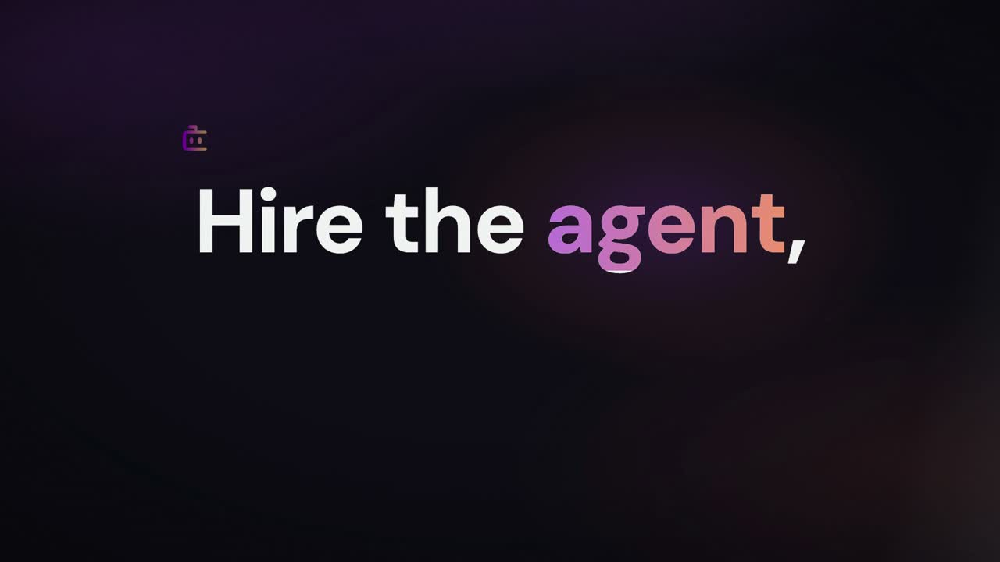

# Product Launch Motion Design — a Claude Code Skill

**Make product launch videos from code.** Install this skill, point Claude Code at your
product, and it directs and renders a launch film: script, voiceover, word-synced reveals,
real camera moves, film grade, broadcast-loudness master — as HTML, CSS and GSAP, rendered
frame by frame to MP4.

<!-- ▶ THE FILM GOES HERE. Replace this block and the poster below with the video embed.
     For an inline player, drag the .mp4 into any GitHub issue comment box (do not submit
     it) and paste the https://github.com/user-attachments/assets/… URL GitHub generates. -->



*45 seconds, eleven shots, entirely code. No After Effects, no stock footage, no GPU
renderer, no diffusion model — and the render is deterministic, so the same commit
produces the same file.*

```bash
npx skills add AbubakrChan/product-launch-motion
```

---

## Why this exists

Programmatic video tools solve rendering. They do not solve **direction** — and direction
is the entire difference between a launch film and a slideshow.

A composition can lint clean, render without error, hit every deadline, and still look
like a template. The gap is craft: does the reveal land on the word? Is the camera
actually moving, or is everything just drifting? Can you see the cursor? Is the
"typing sound" you added *actually audible*, or is it 20 dB under the narration and
mathematically inaudible?

This skill is that craft, written down — ten laws, a fourteen-step pipeline, fourteen shot
constructions, and thirty-four traps, each recorded with **the measurement that proves it**
rather than the vibe that suggested it. It also refuses to hand you a house style: the
laws are fixed, the look is not, and the skill writes three competing visual directions
and kills two before it builds anything
(`references/11-creative-direction.md`).

## What you get

- **`SKILL.md`** — the laws, the pipeline, and a routing table. Under 500 lines so it
  loads fast; everything else is progressive disclosure.
- **12 reference documents** — creative direction; the renderer contract (and how every
  law ports to Remotion); story and truth; word-locked sync; motion grammar; the camera rig
  and cursor spec; look and grade; sound and mastering; QA and direction; the shot catalog;
  the trap index; and deliverables.
- **8 runnable scripts** — assembly, transitions, audio wiring, film grade, SFX levelling,
  word timings, mastering, and cue verification. Dependency-light, idempotent, safe to
  re-run. `assemble.mjs` measures every frame from its voiceover, so a duration is never
  something you type or maintain.
- **5 templates** — brief, storyboard, film manifest, cue table, and a working frame
  skeleton with the camera rig and cursor already built. Copy it; don't retype it.
- **A worked example** — the real film, revision by revision, with the note that prompted
  each change and the measurement that closed it.
- **A baseline evaluation** — the skill was tested against itself: the same two scenarios
  run with and without it, in fresh contexts. That evaluation found three bugs in the
  skill's own scripts and one whole missing chapter, all of which are now fixed. The runs,
  the findings and the resulting changes are in
  [`evals/BASELINE.md`](evals/BASELINE.md).

## Install

```bash
npx skills add AbubakrChan/product-launch-motion
```

Works in Claude Code, and in 16 other agent tools via
[`.agents/skills`](https://github.com/obra/skills). That installs it **into the current project** (`./.agents/skills/`), so it travels with
the repo. For every project on the machine, clone it into your user skills directory
instead:

```bash
git clone https://github.com/AbubakrChan/product-launch-motion \
  ~/.claude/skills/product-launch-motion
```

Then just ask:

> Make a 45-second launch video for my product at example.com

Claude Code loads the skill on any launch-video, promo, demo-reel or motion-design
request. To force it, name it: *"use the product-launch-motion skill"*.

## Requirements

| Need | For | Notes |
|---|---|---|
| **Node ≥ 20** | the scripts | required — the scripts themselves need only Node 18; HyperFrames sets the real floor |
| **FFmpeg** | measuring voiceover, mastering, levelling, verification | required — `brew install ffmpeg` (`ffprobe` ships with it) |
| **A seek-based renderer** | HTML → MP4 | [HyperFrames](https://hyperframes.heygen.com) by default; Remotion notes included |
| **GSAP** | every frame's timeline | required — vendor it, don't CDN it (below) |
| Python ≥ 3.10 | local text-to-speech | optional — only if you want free offline VO |
| A word-level transcriber | sync timings | optional — Whisper locally, or any API that returns word timestamps |

**Vendor GSAP before your first frame.** The frame skeleton loads `vendor/gsap.min.js`,
and a render should need no network at all — a CDN fetch that fails at frame 900 of 1,300
wastes the whole render:

```bash
mkdir -p vendor && curl -sL https://cdn.jsdelivr.net/npm/gsap@3.14.2/dist/gsap.min.js \
  -o vendor/gsap.min.js
```

GSAP is free under its [standard licence](https://gsap.com/licensing/) for this use.

No paid API is required to produce a complete film. Voiceover can be local
([Kokoro-82M](https://github.com/hexgrad/kokoro), ~80M params, runs on CPU), a commercial
TTS voice, or a human recording — the pipeline only needs a WAV and its word timings.

## Quickstart

```bash
# 1 · scaffold + intake
cp assets/BRIEF.md ./BRIEF.md          # product, audience, the ONE claim, approved figures

# 2 · DIRECTION — write three different looks, judge them, kill two, name the
#     signature move. Ten minutes here decides everything downstream.
#     → references/11-creative-direction.md

# 3 · voiceover FIRST — frame durations come from real VO length, never estimates
#     (any TTS or a human recording; output one wav per narration line)

# 4 · word timings → the cue table every frame reads
node scripts/word-timings.mjs --transcript 01.json --id 01-hook --out audio_meta.json
#     (or point it at a directory of them: --in transcripts/ --out audio_meta.json)

# 5 · storyboard, then build one HTML frame per beat. The skeleton gives you the
#     camera rig and cursor; the LOOK comes from your direction, not from it.
cp assets/frame-skeleton.html compositions/frames/01-hook.html

# 6 · assemble → transitions → audio → grade  (this order, every time)
#     assemble.mjs measures each frame from its voiceover — you never type a duration
cp assets/film.example.json ./film.json     # then edit: your frames, your VO, your crossings
node scripts/assemble.mjs && node scripts/transitions.mjs \
  && node scripts/wire-audio.mjs && node scripts/wire-grade.mjs

# 7 · gates, render, master, verify
npx hyperframes check --no-contrast
npx hyperframes render -o renders/video-v1-raw.mp4
./scripts/master.sh renders/video-v1-raw.mp4 renders/video-v1.mp4
./scripts/verify-cue.sh renders/video-v1.mp4 10.72 0.76    # prove the cue is audible
```

## The craft it encodes

Timing and easing — custom-bezier ease-out, spring and settle, staggered entrances,
anticipation, speed ramping, deliberate holds, beat-synced cuts.
**Camera** — dolly, parallax, orbit and turntable, rack focus, whip pan, zoom-to-detail.
**Type** — kinetic typography, mask reveal from the baseline, blur-in, tracking-in,
odometer counters, text morphs.
**Look** — film grain, bloom and halation, chromatic aberration, light sweeps, aurora and
gradient-mesh grounds, glassmorphism, vignette, lifted blacks, a tight palette with one
accent.
**3D and product** — exploded views, floating isometric mockups, HDRI-style lighting.
**SaaS and UI** — fake cursor with ripples, UI card staggers, skeleton-to-results loading,
progressive disclosure, state flips.
**Sound** — whooshes, UI ticks, sub-bass on hero hits, and silence before the reveal.
**Structure** — cold opens, problem-agitate-solve arcs, register flips as story turns.

Each one is documented as *when to use it and what breaks*, not just as a name.

## Stack — and what we tried before settling

Before settling on this stack, five motion tools were raced — one beat each, built and
rendered for real rather than compared on paper. The verdicts are baked into the skill so
you don't repeat the experiment:

| Tool | Verdict | Why |
|---|---|---|
| **GSAP** | **Core of the system** | Best craft-per-cost, seek-deterministic, zero new dependency. Every frame's timeline is one paused GSAP timeline. |
| **HyperFrames** | **The renderer** | HTML-as-video with a seekable timeline, word-level audio mounting and a real lint/layout/contrast gate. |
| **Lottie** (`lottie-web`) | **Use for logo draw-ons** | Great for vector draw-on. Trap: an animated multi-dimensional *layer* transform silently blanks the layer in render while playing fine in preview. Keep layer transforms static; drive motion from GSAP on the container. |
| **Remotion** | **Per-shot co-host** | Genuinely better React ergonomics, real `spring()` physics, and a WebGL post pass over live DOM. We kept the long-form film elsewhere for its word-sync workflow, but Remotion is a first-class choice — the skill's laws all port. |
| **Three.js** | **One hero shot only** | The only real-camera, real-light route without a GPU renderer. Trap: bloom over a near-white UI screenshot blows out to a white cloud — tone-map first. |
| **Rive** | **Runtime yes, authoring no** | The runtime is seek-deterministic (verified: 150 frames rendered twice, identical hashes). But `.riv` is a compiled binary and the editor is GUI-only, so an agent can't author one. |
| After Effects, C4D, Octane, Blender | **Ruled out** | GUI-only or not installable. An agent cannot drive them. This is why the whole system is code. |

## A taste of the trap index

These are the ones that cost hours. All 34 are in `references/10-traps.md`.

- **Cue volume cannot rescue a quiet source.** Raising a typing SFX from `0.35` to `0.85`
  moved the delivered mix by **0.1 dB** — because the source sat at −37 dB mean under a
  −21 dB narration stem. Level the asset, not the cue. (Measure against the isolated
  **stem**, not the mastered window — the window in this film read −16.7 dB, a 4.6 dB
  error in exactly the direction that flatters the cue.)
- **`alimiter` silently applies makeup gain** unless you pass `level=disabled`, which
  pushed a −14 LUFS master to −13.0 LUFS / −0.0 dBFS — louder than the target the limiter
  was added to protect.
- **A `mix-blend-mode` overlay renders the whole film white** when each track composites
  as its own layer — a `multiply` vignette over transparency paints its own source colour.
- **`object-position` is inert when source and box share an aspect ratio**, so it cannot
  reframe a square avatar from a square photo. It looks like it should. It does nothing.
- **Per-frame grain destroys compression** — a 9.3 MB render became 67.3 MB and read as
  electronic sizzle. Re-seed at 12 Hz, like real film held across frames.
- **A full-canvas grade breaks automated contrast checks**, which then report bogus
  1.06:1 ratios. Gate with the grade off, ship with it on.

## FAQ

**Will every video made with this look the same?**
No. The pipeline forces three competing directions before any building, and a checklist
names the skill's own defaults so an agent can catch itself reaching for them. What
repeats is the discipline — sync, determinism, sound arithmetic, mastering — not the
aesthetic. `references/11-creative-direction.md`.

**Does this work for physical products, not just software?**
Yes. The shot catalog covers hardware heroes, unboxing and exploded views, e-commerce
line items and floating product mockups alongside the SaaS shots. The laws are
product-agnostic; only the shot selection changes.

**Do I have to use HyperFrames?**
No. The laws — word-locked sync, the two-node camera, the cursor spec, sound arithmetic,
mastering — are renderer-neutral, and `references/01-renderer-contract.md` includes the
Remotion equivalents. HyperFrames is the default because it ships the gates.

**Can I use my own voice, or a cloned one?**
Yes. The pipeline needs a WAV plus word-level timestamps. Anything that produces those
works — human recording, ElevenLabs, local Kokoro. Swapping voices means re-deriving the
timings, because every cue is locked to the words.

**Is this an AI video generator?**
No, and that is the point. Nothing is diffused or hallucinated. Every frame is code you
can read, diff and fix, so the output is deterministic, brand-exact, and never invents a
number or a face.

**How long does a film take?**
Measured on an M-series laptop: the 44-second reference film **renders in 51s**
(`rendered in 51.1s`, 40 MB raw) and **masters in 30s** (`real 30.35` — two ffmpeg
passes plus a full re-encode, and the re-encode is most of it). The direction loop — the part that matters — takes as many passes as you have
notes.

## Troubleshooting

The trap index covers defects in the *film*. These are the ones that bite while setting up.

| What you see | What it means |
|---|---|
| `no film.json — copy assets/film.example.json and edit it` | The manifest is the input to the whole chain. Copy the example; it is the reference film's real one. |
| `no index.html — run assemble.mjs first` | Wiring scripts mount into an assembled index; they never create one. |
| `no cue table at audio/cues.json` | `cp assets/cues.example.json audio/cues.json`, then edit. |
| `no frame wrappers in index.html — assemble first` | Your index has no `data-composition-src` elements, so there is nothing to time against. |
| `<file> has no transitions markers` | The index wasn't written by `assemble.mjs`. Re-assemble, or paste `/* transitions:start */ … /* transitions:end */` into your root timeline's IIFE. |
| `ffprobe not found — install ffmpeg` | `brew install ffmpeg` (Linux: `apt install ffmpeg`). Needed to measure voiceover, not just to master. |
| `gsap is not defined` in the render | You copied the frame skeleton without vendoring GSAP — see Requirements. |
| A tween plays in preview and is missing in the render | Something in it is non-deterministic — `Math.random`, `Date.now`, a CSS `transition`, `repeat`/`yoyo`. The renderer seeks; it does not play. See the determinism rules in `references/01-renderer-contract.md`. |
| The whole film renders white | A `mix-blend-mode` over a per-track composite: a `multiply` vignette with no backdrop paints its own source colour. Trap 1, and it is not visible in the source. |
| An edit to `index.html` keeps disappearing | The index is generated. Put it in a wiring script's marked block instead. Trap 3. |
| Everything works and the film is boring | That is the actual hard problem, and it is what `references/11-creative-direction.md` and `08-qa-and-direction.md` are for. |

Every script takes `--help` and prints its own documentation.

## Contributing

Traps are the most valuable contribution. If you find one, open a PR against
`references/10-traps.md` with the measurement that proves it — the number, the command,
and the before/after. That standard is the whole reason this file is useful.

## License

MIT — see [`LICENSE`](LICENSE). The craft is meant to travel.

**The film does not.** The reference film and the frame reproduced under `examples/`
belong to the client it was made for. See [`NOTICE`](NOTICE) — it also covers GSAP, which
these docs tell you to vendor into your own project.
